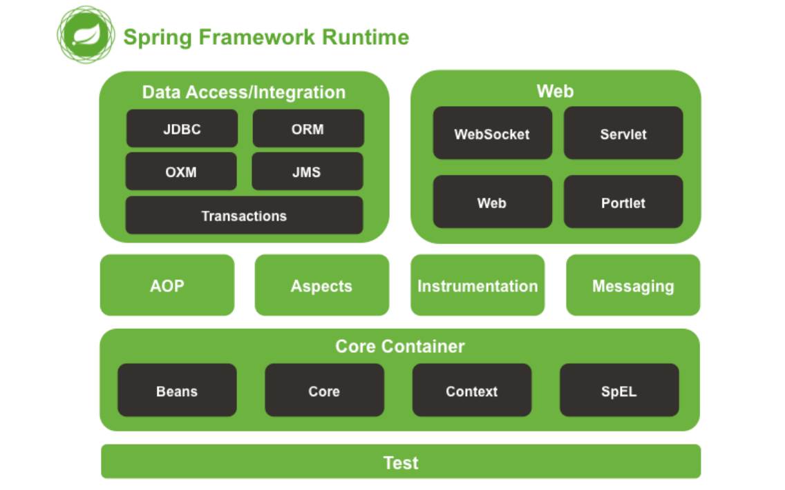

# 项目说明
## 1、主要功能
	Spring的控制反转（IOC）;
	IOC创建对象的方式。
## 2、主要知识点
### Spring
#### 概述
	含义: Spring是一个轻量级的控制反转(IOC)和面向切面(AOP)的容器框架；
	理念：使现有技术更加的实用【实质就是整合现有的框架技术】；
	优点:  
		a. 轻量级框架（不具有侵入性-使用它不用去继承或者实现某些接口，灵活性好）  		b. 控制反转(IOC):Spring使用控制反转技术实现了松耦合。依赖被注入到对象，而不是创建或寻找依赖对象 
		c. 面向切面编程(AOP):支持面向切面编程，把应用业务逻辑与系统的服务分离开来  
		d. 容器:Spring包含并管理对象的配置及生命周期。  
		e.MVC框架:Spring的web框架是一个设计优良的web MVC框架，很好的取代了一些web框架。  
		f. 事务管理:Spring对本地业务和全局业务(JAT)提供了统一的事务管理接口。 
		g.异常处理:Spring提供了一个方便的API将特定技术的异常(由JDBC, Hibernate, 或JDO抛出的异常)转化为统一的Unchecked异常。
#### 核心架构

#### 控制反转
	控制:由谁来控制对象的创建---以前对象的创建是由程序本身或者说是我们创建，使用Spring后由Spring容器来创建对象。
	反转:指程序本身不创建对象，而变为被动接收对象。
	结论:IOC的实质就是spring帮我们创建、管理、维护对象
#### IOC常见创建对象方式 
	A.无参构造 
	B.有参构造
## 3、说明
## 4、报错
## 5、附加
### Spring
	官网：https://spring.io/
	API-Framework：https://spring.io/projects/spring-framework
```
<?xml version="1.0" encoding="UTF-8"?>
<beans xmlns="http://www.springframework.org/schema/beans"
	xmlns:xsi="http://www.w3.org/2001/XMLSchema-instance"
	xsi:schemaLocation="http://www.springframework.org/schema/beans
        https://www.springframework.org/schema/beans/spring-beans.xsd">
</beans>
```

### 依赖

	Spring-context：https://mvnrepository.com/artifact/org.springframework/spring-context

```
<!-- spring-context依赖 -->
<!-- https://mvnrepository.com/artifact/org.springframework/spring-context -->
<dependency>
	<groupId>org.springframework</groupId>
	<artifactId>spring-context</artifactId>
	<version>5.2.4.RELEASE</version>
</dependency>
```

